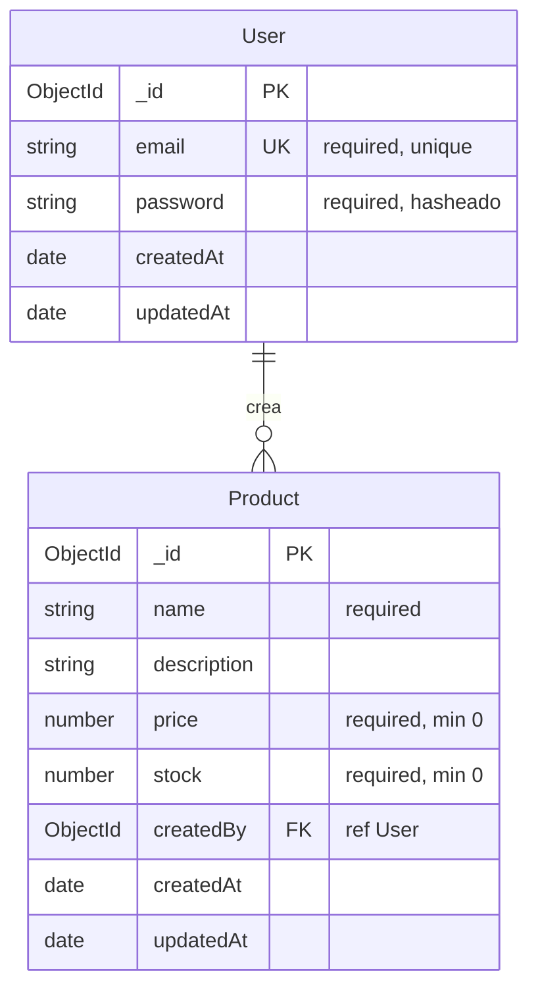

# Diagrama entidad-relación y justificación de la plataforma SaaS

## 1. Diagrama entidad-relación

El sistema utiliza MongoDB (base de datos documental). A continuación se presenta el modelo de datos equivalente a un diagrama entidad-relación: dos colecciones (User, Product) con una relación uno-a-muchos (un usuario puede crear muchos productos).

### Diagrama (Mermaid)

### Descripción de entidades

| Entidad   | Atributo    | Tipo     | Restricciones / Notas                          |
|-----------|-------------|----------|-------------------------------------------------|
| **User**  | _id         | ObjectId | Clave primaria (MongoDB)                        |
|           | email       | String   | Requerido, único, lowercase                     |
|           | password    | String   | Requerido, mínimo 6 caracteres, almacenado hasheado (bcrypt) |
|           | createdAt   | Date     | Timestamp automático                            |
|           | updatedAt   | Date     | Timestamp automático                            |
| **Product** | _id       | ObjectId | Clave primaria                                  |
|           | name        | String   | Requerido                                       |
|           | description | String   | Opcional                                        |
|           | price       | Number   | Requerido, ≥ 0                                  |
|           | stock       | Number   | Requerido, ≥ 0, default 0                        |
|           | createdBy   | ObjectId | Referencia a User (quien crea el producto)      |
|           | createdAt   | Date     | Timestamp automático                            |
|           | updatedAt   | Date     | Timestamp automático                            |

### Relación

- **User 1 ──► N Product:** Un usuario puede tener muchos productos; cada producto pertenece a un único usuario (createdBy). La relación se implementa en Mongoose con `ref: 'User'` en el esquema de Product.

---

## 2. Justificación de la elección de la plataforma SaaS (Vercel)

Se eligió **Vercel** como plataforma SaaS para alojar el servidor Node.js por las siguientes razones:

1. **Compatibilidad con Node.js y Express**  
   Vercel soporta aplicaciones Express sin cambios estructurales grandes: la aplicación se exporta como un único punto de entrada (`src/app.js`) y Vercel la ejecuta como función serverless. Esto cumple con el requisito de alojar un servidor Node.js en un entorno SaaS.

2. **Integración con Git y CI/CD**  
   La conexión con GitHub es nativa. Cada push a la rama principal puede desencadenar un despliegue automático. El pipeline de CI/CD del proyecto (GitHub Actions) ejecuta primero las pruebas y, si pasan, despliega en Vercel, lo que asegura que solo se suba código validado y un despliegue eficiente.

3. **Escalabilidad y coste**  
   El modelo serverless escala con la demanda y el plan gratuito es suficiente para proyectos académicos o de pequeño tamaño. No es necesario administrar servidores ni configurar infraestructura.

4. **Variables de entorno y seguridad**  
   Los secretos (JWT_SECRET, MONGODB_URI) se configuran como variables de entorno en el panel de Vercel, sin incluirlos en el código, alineado con buenas prácticas de seguridad.

5. **Alternativas consideradas**  
   Se consideraron otras opciones (Railway, Render, Heroku). Vercel se eligió por la documentación clara para Express, el despliegue rápido, la integración directa con GitHub y la posibilidad de usar el mismo flujo para frontends estáticos (p. ej. la vista de login en `public/`).

En conjunto, la documentación incluye los requerimientos funcionales y no funcionales detallados (en `REQUERIMIENTOS.md`), este diagrama de entidad-relación y la justificación de la plataforma SaaS, cumpliendo con los requisitos de documentación del proyecto.
